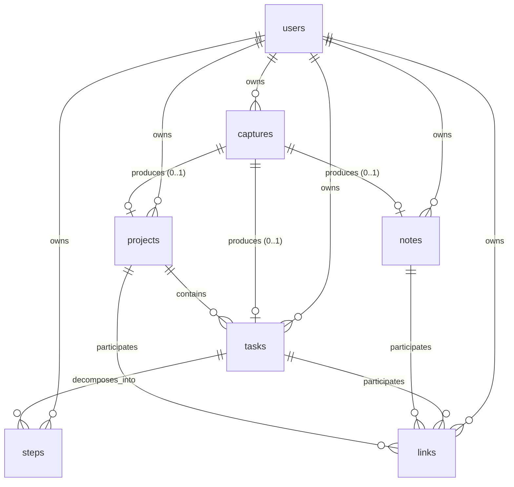

# Kiwi — Product Requirements Document

> **Status:** Living doc. Phase 1 is detailed; Phases 2–5 are stubbed and will be filled in as their phase approaches.
> **Source-of-truth ordering:** This PRD > Working Context > README. If they disagree, fix the lower one.

---

## 0. About this document

- **Audience:** the builder (me), reviewers, future contributors.
- **Naming:** product is **Kiwi**. Some history references "DayFlow"; ignore those.
- **Companion docs:** `/docs/working-context.md` (decisions, conventions, open questions). Don't duplicate that content here — link to it.
- **Phase boundaries are commitments**, not suggestions. A feature lives in exactly one phase. Cross-phase work is called out explicitly.

---

## 1. Product overview

### 1.1 Problem

Two failure modes kill personal productivity tools:

1. **Capture friction.** Existing tools demand pre-categorization (todo? note? calendar?). The decision overhead drops thoughts before they're written down.
2. **Noise accumulation.** Once captured, tasks pile up. The 3 things that matter today drown in the 40 that don't.

### 1.2 Approach

- **One capture surface.** Voice in. AI sorts.
- **Three buckets, one model.** Every captured thought becomes a Task, a Lightbulb (note), or a Project Plan. Tasks are the atomic unit — everything links back.
- **Top 3 a day.** AI scores all active tasks on a Signal-vs-Noise axis and surfaces three. Phase 2.
- **Opinionated defaults, minimal config.** This is a personal tool first; building for the way I think.

### 1.3 Audience & non-goals

- **Audience at launch:** single-user, English, iOS.
- **Non-goals (any phase, unless explicitly added):** team features, sharing, real-time collab, multi-language UI, public APIs for third-party integrations.

### 1.4 Stack (locked)

See `working-context.md §1`. Summary: React Native + NativeWind, Supabase, DeepSeek v4 Pro, iOS Speech framework, MIT.

---

## 2. Phases at a glance

| Phase | Theme | Status |
|---|---|---|
| **1** | Capture core | **Detailed below — in progress** |
| 2 | Prioritization & dialogue | Stubbed |
| 3 | Reflection & focus | Stubbed |
| 4 | Personal finance | Stubbed |
| 5 | Cross-platform | Stubbed |

---

## 3. Phase 1 — Capture Core

### 3.1 Goals

Ship the smallest version of Kiwi that proves the core loop:

> Voice in → AI triage → it ends up in the right place → I can find it, edit it, complete it.

If a real user (me) can replace their current capture habit with Kiwi for two weeks without rage-quitting, Phase 1 is done.

### 3.2 Non-goals (explicit, for Phase 1)

- Top-3 ranking — Phase 2.
- Project AI dialogue with personas — Phase 2.
- Memory layer / AI search — Phase 2.
- Daily shutdown, weekly review — Phase 3.
- Push notifications, reminders — Phase 3.
- Apple/Google Calendar sync — open question, deferred.
- Native widgets, Siri shortcuts, Apple Watch — deferred.
- Sharing, export — deferred.

### 3.3 User flows

#### 3.3.1 First-run

1. Open app → email magic-link sign-in.
2. One-screen explainer: "Tap and hold to capture. AI sorts it." → "Got it."
3. Land on Today view (empty state with a single CTA: capture button).

#### 3.3.2 Capture

1. User taps and holds the capture button (or taps once for hands-free mode).
2. Audio records, on-device transcript streams in.
3. User releases (or taps stop).
4. App shows transcript + a placeholder card while classification runs.
5. Within ≤5s end-to-end, the card resolves into a Task / Lightbulb / Project, with a brief "moved to ___" affordance.
6. User can swipe to undo or tap to edit.

#### 3.3.3 Manage tasks

- See tasks in one of three views (Calendar, Kanban, List).
- Tap a task to open detail: title, description, due date, project, steps, linked notes, status.
- Edit any field. Mark complete. Add steps. Link to project. Link to notes.

#### 3.3.4 Browse projects & notes

- Projects tab: list of all projects → tap into project detail (linked tasks + notes).
- Notes tab: flat list of all Lightbulbs → tap into note detail. Promote to task with one action.

### 3.4 Features

Each feature has **Functionality** (what it does, acceptance criteria) and a **Data** pointer to §3.5.

---

#### 3.4.1 Voice capture

**Functionality**

- Single global capture button, persistent at bottom of screen on all main tabs.
- **Hold-to-record** is primary; release to send. **Tap-to-toggle** is the fallback for longer captures (tap once to start, again to stop).
- Uses iOS Speech framework on-device. No audio leaves the phone unless the user opts into audio retention (off by default).
- Transcript streams visibly during recording.
- Cancel gesture: drag up while holding → discard.
- Hard cap on capture length: **60 seconds**. Beyond that, auto-stops and submits.
- Empty/very-short transcripts (<3 chars) are dropped with a toast, not sent for classification.

**Acceptance criteria**

- Hold-to-record latency from press to first transcript token: **<400ms**.
- End-to-end (release → classified card visible): **<5s p50, <8s p95**, on a clean network.
- Permission prompts (mic, speech recognition) appear once, with copy explaining why.
- App handles permission denial gracefully — capture button shows a one-tap fix.

**Data:** `captures` table.

---

#### 3.4.2 AI classification (triage)

**Functionality**

- Transcript is sent to a Supabase edge function, which proxies to DeepSeek v4 Pro.
- Model returns:
  - `bucket`: one of `task | lightbulb | plan | unknown`
  - `confidence`: 0.0–1.0
  - `extracted`: structured fields per bucket (see below)
  - `rationale`: short string for debug/UI affordance
- The edge function writes the resulting record (`tasks`, `notes`, or `projects`) and links it to the originating `capture`.

**Extraction per bucket:**

| Bucket | Extracted fields |
|---|---|
| `task` | `title`, optional `due_at`, optional `project_hint` (string the model thinks names a project), optional `step_titles[]` if it heard a list |
| `lightbulb` | `title`, `body` |
| `plan` | `title`, `intent` (one-sentence summary) |
| `unknown` | falls back to a `lightbulb` with a `low_confidence` flag |

- If `project_hint` matches an existing project (case-insensitive contains), task is auto-linked. Otherwise the hint is stored as a string on the task for later resolution; user is shown a chip to confirm/create the project.
- Classification is **non-blocking on the UI thread** — capture card shows a spinner and resolves in place.
- Errors (network, model timeout, model error): capture is preserved as `unknown`; user can retry or manually classify.

**Acceptance criteria**

- Triage accuracy on a labeled eval set: **≥85%** before Phase 1 ships. (Eval set construction is itself a Phase 1 task; see Open Questions.)
- Median classification latency: **<2s**.
- All capture failures are recoverable — no transcript is ever lost.

**Data:** `captures.classification`, plus the resulting record in `tasks` / `notes` / `projects`.

---

#### 3.4.3 Task management

**Functionality**

- CRUD for tasks: create (manual or via capture), read, edit, delete, complete.
- Fields: `title`, `description`, `status` (`backlog | today | doing | done`), `due_at`, `project_id`, `steps[]`, `linked_note_ids[]`.
- Steps: ordered list of sub-items, each with optional own `due_at` and `status` (`pending | done`).
- Completion %: rolls up steps → task. Project rollup is read-only in Phase 1 (computed, not stored).
- Manual reordering of steps (drag handle).
- Bidirectional links: linking a note to a task surfaces in both task detail and note detail. (See `working-context.md §2 — Data model invariants`.)
- Step due date, when present, **replaces** the parent task's due date on the calendar view (not in addition to). Per Working Context.

**Acceptance criteria**

- Editing any field is single-tap → inline edit, no modal stacks.
- Delete is soft (sets `deleted_at`). Hard delete is a settings option only.
- Optimistic updates: edits apply locally before server confirmation; rollback on failure with a toast.

**Data:** `tasks`, `steps`, `links` tables.

---

#### 3.4.4 Task views: Calendar, Kanban, List

**Functionality**

Three views over the same task set, switched via a segmented control at the top of the Tasks tab. View choice persists per session.

**Calendar view**
- Default zoom: week (7 days, vertical day columns).
- Pinch / toggle to month view (read-only — tap a day to drill in).
- Tasks placed by `due_at`. Tasks without `due_at` do **not** appear in calendar — they live in backlog (visible in Kanban/List).
- Steps with their own `due_at` render in place of the parent task.
- Drag a task to a new day = updates `due_at`.
- Tap a task = opens detail sheet.

**Kanban view**
- Four columns: **Backlog**, **Today**, **Doing**, **Done**.
- `status` field drives column placement.
- Drag between columns = updates `status`. Moving to **Today** also sets `due_at = today` if unset. Moving to **Done** sets `completed_at = now()`.
- Done column is collapsed by default, last 7 days only.

**List view**
- Flat list of all non-done tasks, grouped by section (Overdue / Today / Tomorrow / This Week / Later / No date).
- Sort: due date ascending within each group.
- Filter chips: by project, by has-steps, by has-linked-notes.
- Search bar: title + description substring match.

**Acceptance criteria**

- Switching views is instant (no skeleton loaders for already-loaded data).
- All three views read from the same query / cache; an edit in one is reflected in the others without a manual refresh.
- Calendar drag-to-reschedule has haptic feedback and an undo affordance.

**Data:** all three views are pure projections of `tasks` + `steps`. No view-specific schema.

---

#### 3.4.5 Projects list

**Functionality**

- **Projects tab** in the main nav. Lists all projects, sorted by `updated_at` desc.
- Each row shows: title, task count, completion %.
- Tap → **Project detail**:
  - Title, description (editable inline).
  - Status (`active | completed | archived`).
  - **Tasks** section: tasks where `task.project_id = this.id`.
  - **Notes** section: notes linked via `links` table.
  - Add task button → creates a task pre-linked to this project.
- Manual project creation from the Projects tab (no voice required).
- Voice-created projects (bucket = `plan`) land here. In Phase 1, a `plan` capture creates a project with the transcript as `description` and the model's `title` as title — no AI dialogue yet.

**Acceptance criteria**

- A task whose `project_hint` matches an existing project is auto-linked at classification time.
- Deleting a project does **not** delete its tasks; tasks become orphaned (`project_id = null`) with a toast offering bulk delete.

**Data:** `projects`, plus `tasks.project_id` and `links` for note↔project.

---

#### 3.4.6 Notes list (Lightbulbs)

**Functionality**

- **Notes tab** in main nav. Flat list of all notes, sorted by `created_at` desc.
- Each row: title (or first line of body), preview, age.
- Tap → **Note detail**: title, body (markdown-supported, plain rendering for Phase 1), linked tasks, linked projects.
- Actions on a note:
  - **Promote to task** — creates a task from the note's content; note is preserved with `status = promoted` and a back-link.
  - **Link to task / project** — picker sheet.
  - **Edit** — inline.
  - **Archive** / **Delete**.
- Search: substring match on title + body.

**Acceptance criteria**

- Promote-to-task is a single tap with no confirmation modal.
- Promoted notes remain visible in the notes list with a subtle `promoted` chip; an "Active only" filter hides them.

**Data:** `notes`, plus `links` for task↔note and project↔note.

---

#### 3.4.7 Auth & onboarding

**Functionality**

- Supabase Auth with three providers in Phase 1:
  - **Sign in with Apple** — required for App Store submission; native flow via `expo-apple-authentication` or RN equivalent.
  - **Sign in with Google** — native flow on iOS via Google Sign-In SDK; bridges to Supabase OAuth.
  - **Email magic link** — fallback for users who want neither.
- Sign-in screen presents Apple first, Google second, email third. Order matters for iOS Human Interface Guidelines compliance (Apple must be at least as prominent as competing providers).
- No password auth. No SSO/SAML. No other OAuth providers.
- Single device assumption in Phase 1 — no multi-device sync conflict resolution beyond Postgres last-write-wins.

**Acceptance criteria**

- Cold-start to authenticated home: **<3s** on a warm app launch.
- All three providers land the user in the same post-auth state — no provider-specific onboarding branches.
- Sign-out is one tap from settings; clears local cache and revokes the Supabase session.
- Account deletion (also App Store requirement when sign-in exists): one tap from settings, confirmed, hard-deletes user data within 30 days.

**Data:** `auth.users` (Supabase-managed, includes `provider` field). `user_id` foreign keys throughout.

---

#### 3.4.8 Offline read-only browsing

**Functionality**

- Local cache of last-synced state via SQLite (library TBD — see Working Context open questions).
- Offline behavior:
  - **Allowed:** browsing all three task views, project detail, note detail, search.
  - **Disabled:** capture button (greyed out with "Offline" label), edits, completions, deletes.
- Sync strategy: pull-on-foreground, plus realtime via Supabase channels when online.

**Acceptance criteria**

- App opens to last-known state in <1s without a network roundtrip.
- An offline app never shows stale-data warnings unless the cache is >24h old.

**Data:** local mirror of `tasks`, `steps`, `notes`, `projects`, `links`.

---

#### 3.4.9 Eval harness (internal)

Not user-facing. A Phase 1 deliverable because every change to the classification prompt, model, or extraction logic needs measurable feedback before it ships.

**Functionality**

- **Labeled dataset** stored at `/evals/triage/dataset.jsonl` in the repo.
  - Each row: `{ id, transcript, expected_bucket, expected_extracted, notes }`.
  - Target size for Phase 1 ship: **≥100 samples**, drawn from real captures during dogfood (with consent — only the primary user's own captures).
  - Coverage target: each bucket (`task`, `lightbulb`, `plan`) has ≥25 samples; ≥10 are intentional edge cases (ambiguous, multilingual EN/ZH, very short, very long).
- **Runner CLI:** `pnpm eval triage` (or equivalent).
  - Reads dataset, hits the staging classification edge function, writes results to `/evals/triage/runs/{timestamp}.json`.
  - Outputs: per-sample pass/fail, overall accuracy, per-bucket accuracy, confusion matrix, p50/p95 latency.
  - Exit code non-zero if accuracy regresses below a threshold (configurable; default = previous run's accuracy minus 2pp).
- **Diff view:** comparing two runs surfaces only the samples whose result changed. Used during prompt iteration.
- **Hooked into CI:** runs on every PR that touches the classification prompt, edge function, or model config. Posts a comment with the diff.

**Acceptance criteria**

- Full eval run (100 samples) completes in **<3 minutes** against staging.
- Cost per full run: tracked and surfaced in the run output (model token usage × price).
- A new sample can be added to the dataset in under 30 seconds — capture in app, then a "send to eval set" debug action copies the transcript + classification into a draft labeled row.

**Data:** dataset in repo, not in Postgres. Runs are local artifacts (gitignored). No schema changes.

**Out of scope for Phase 1:** evaluating extraction quality (due dates, project hints, step lists) beyond exact match. Phase 2 introduces fuzzier scoring.

---

### 3.5 Data schema (Phase 1)

#### 3.5.1 ER diagram

#### 3.5.2 Tables

All tables include `id uuid pk`, `user_id uuid fk auth.users`, `created_at timestamptz default now()`, `updated_at timestamptz default now()`, `deleted_at timestamptz null` unless noted. RLS: every table is `user_id = auth.uid()`.

##### `captures`

| Column | Type | Notes |
|---|---|---|
| `id` | uuid | pk |
| `user_id` | uuid | fk |
| `transcript` | text | required |
| `audio_url` | text | nullable; only set if user opted into audio retention |
| `bucket` | enum(`task`,`lightbulb`,`plan`,`unknown`) | classification result |
| `confidence` | float | 0.0–1.0 |
| `metadata` | jsonb | extracted fields, model version, latency, rationale |
| `produced_task_id` | uuid | fk tasks, nullable |
| `produced_note_id` | uuid | fk notes, nullable |
| `produced_project_id` | uuid | fk projects, nullable |
| `created_at` | timestamptz | |

##### `tasks`

| Column | Type | Notes |
|---|---|---|
| `id` | uuid | pk |
| `user_id` | uuid | fk |
| `capture_id` | uuid | fk captures, nullable |
| `project_id` | uuid | fk projects, nullable |
| `title` | text | required |
| `description` | text | nullable |
| `status` | enum(`backlog`,`today`,`doing`,`done`) | default `backlog` |
| `due_at` | timestamptz | nullable |
| `project_hint` | text | nullable; raw string from model when no match |
| `completed_at` | timestamptz | nullable |
| `created_at` / `updated_at` / `deleted_at` | timestamptz | |

Indexes: `(user_id, status)`, `(user_id, due_at)`, `(user_id, project_id)`.

##### `steps`

| Column | Type | Notes |
|---|---|---|
| `id` | uuid | pk |
| `task_id` | uuid | fk tasks, on delete cascade |
| `user_id` | uuid | fk |
| `title` | text | required |
| `status` | enum(`pending`,`done`) | default `pending` |
| `due_at` | timestamptz | nullable; replaces parent on calendar when set |
| `order_index` | int | required, unique within task |
| `completed_at` | timestamptz | nullable |
| `created_at` / `updated_at` / `deleted_at` | timestamptz | |

Indexes: `(task_id, order_index)`.

##### `notes`

| Column | Type | Notes |
|---|---|---|
| `id` | uuid | pk |
| `user_id` | uuid | fk |
| `capture_id` | uuid | fk captures, nullable |
| `title` | text | required (model-extracted or first line) |
| `body` | text | nullable |
| `status` | enum(`active`,`promoted`,`archived`) | default `active` |
| `created_at` / `updated_at` / `deleted_at` | timestamptz | |

##### `projects`

| Column | Type | Notes |
|---|---|---|
| `id` | uuid | pk |
| `user_id` | uuid | fk |
| `capture_id` | uuid | fk captures, nullable |
| `title` | text | required |
| `description` | text | nullable |
| `status` | enum(`active`,`completed`,`archived`) | default `active` |
| `created_at` / `updated_at` / `deleted_at` | timestamptz | |

##### `links`

Generic bidirectional join. Stored canonically (smaller `(type,id)` tuple as `source`) to dedupe.

| Column | Type | Notes |
|---|---|---|
| `id` | uuid | pk |
| `user_id` | uuid | fk |
| `source_type` | enum(`task`,`note`,`project`) | |
| `source_id` | uuid | |
| `target_type` | enum(`task`,`note`,`project`) | |
| `target_id` | uuid | |
| `created_at` | timestamptz | |

Constraints: unique `(user_id, source_type, source_id, target_type, target_id)`.
Disallowed in Phase 1: `task ↔ task` links (covered by project membership instead).

#### 3.5.3 Computed/derived (not stored)

- Task completion % = `done_steps / total_steps` (or `1.0` if status = `done` with no steps).
- Project completion % = average of contained tasks' completion %.

### 3.6 API surface (Phase 1)

All client → server traffic goes through Supabase: PostgREST for CRUD, edge functions for AI calls.

**Edge functions:**

| Function | Purpose |
|---|---|
| `POST /classify` | Body: `{ transcript, capture_id }`. Calls DeepSeek, writes capture + produced record, returns the produced record. |
| `POST /reclassify` | Body: `{ capture_id }`. Re-runs classification on an existing capture (manual override). |

**RPCs (Postgres functions):**

| RPC | Purpose |
|---|---|
| `promote_note_to_task(note_id)` | Atomic: creates task, sets note.status = promoted, creates link. |
| `complete_task(task_id)` | Sets status, completed_at, cascades step completion. |

Direct PostgREST is used for everything else.

### 3.7 Phase 1 success criteria

Phase 1 is shippable when **all** are true:

1. Capture → classified card on screen, p95 ≤ 8s, on a labeled eval set of ≥100 samples.
2. Triage accuracy ≥85% on the eval set.
3. All three task views render the same data consistently and update in real time.
4. Two-week dogfood by primary user without falling back to another tool for capture.
5. Crash-free sessions ≥99.5% over the dogfood period.
6. Cold-start to interactive ≤3s on iPhone 13 or newer.

---

## 4. Phase 2 — Prioritization & Dialogue

> **Status:** Stubbed. To be detailed at end of Phase 1.

**Themes:**
- **Top-3 ranking.** Daily Signal-vs-Noise scoring across all active tasks. Re-ranks on capture and on demand.
- **Project dialogues with personas.** Voice/text back-and-forth with a selectable persona (skeptical investor, supportive coach, ruthless editor, systems thinker). Output writes back as plan + tasks + notes.
- **Memory layer.** AI has access to user's prior captures, completed tasks, and notes for context.
- **AI search.** Semantic search across tasks, notes, projects.

**Schema additions (sketch):** `task_scores`, `dialogues`, `dialogue_turns`, `embeddings`.

**Open before detailing:** Top-3 hard cap (3) vs. configurable (1–5). See Working Context open questions.

---

## 5. Phase 3 — Reflection & Focus

> **Status:** Stubbed.

**Themes:**
- **Daily shutdown.** End-of-day prompt: review completed, defer remaining, surface tomorrow's top 3.
- **Weekly review.** Velocity, completion rate, project momentum, signal-vs-noise hit rate.
- **Focus mode.** Dim non-Top-3 tasks; optional Pomodoro timer integration.
- **Notifications & reminders.** First introduction of push.

---

## 6. Phase 4 — Personal Finance

> **Status:** Stubbed.

**Themes:**
- **Assets, investments, budgets, savings goals.**
- Tasks can link to finance entries (e.g., "renew CD" task ↔ CD asset).
- Encryption posture is an open question (see Working Context).

---

## 7. Phase 5 — Cross-platform

> **Status:** Stubbed.

**Themes:**
- **Android, HarmonyOS, web (read/search).**
- Cloud STT fallback (open question — Working Context).
- Self-hosting docs land here or earlier, depending on cloud stability.

---

## 8. Cross-cutting concerns

- **Conventions, tone, naming:** see `working-context.md §2`.
- **Build-in-public policy:** see `working-context.md §3`.
- **Decision log:** see `working-context.md §4`.
- **Open questions:** see `working-context.md §5`. Phase 1–blocking items in that list:
  - Local cache library (op-sqlite vs. expo-sqlite vs. WatermelonDB).

---

## 9. Changelog

| Date | Change |
|---|---|
| 2026-04-28 | Initial PRD with Phase 1 detailed, Phases 2–5 stubbed. |
| 2026-04-28 | Phase 1: added Apple + Google Sign-In; added eval harness as explicit deliverable (removed from open questions). |
